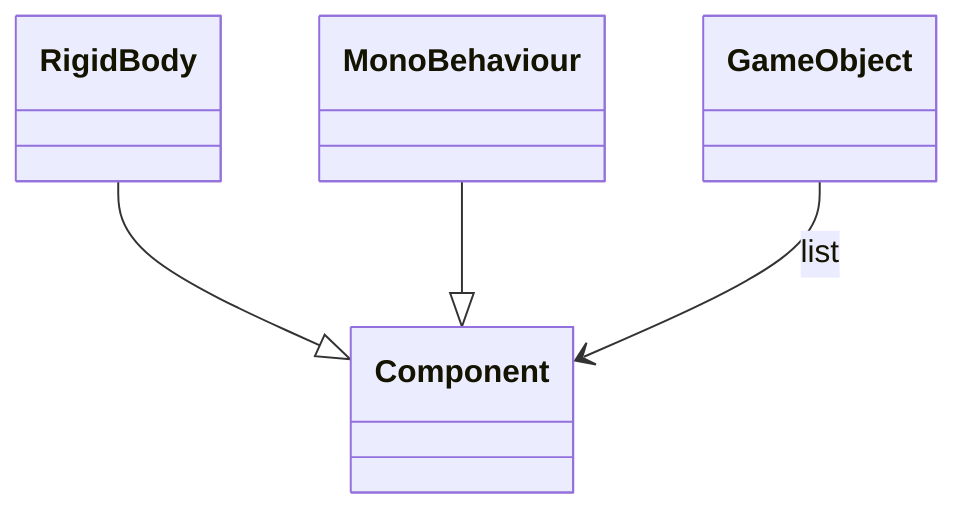

## 왜

React-Three-Fiber [미니플젝](/demo/jukebox/) 하며 게임로직 & 렌더 패턴에 대해 찾아보다가 ECS를 발견했다. 직관적이고 실용적인 패턴이라고 생각돼서 기본적인 내용들을 정리해 본다.

## 그동안 내가 했던 방법들

### C++ / DirectX

3D / 2D 게임의 클라이언트 및 서버를 개발했던 시기였다. 엔진 이라고 부를만한 프레임워크가 없이 렌더 부분만 래핑해놓은 유틸성 라이브러리만 가지고 개발을 했다.

상속을 기반으로 개체 내에서 Update, Render 모두 진행하는 구조로 개발했다.

### Unity

Unity는 기본적으로 GameObject를 생성을 하고 기대하는 동작들을 스크립트로 만들어 오브젝트에 할당하는 컴포넌트 방식을 따른다. 입출력, 움직임, 렌더등을 컴포넌트화 시킨다. 하나의 거대한 클래스가 존재하는게 아닌, 분리된 역할을 가진 컴포넌트들의 조합으로 복잡한행동(behaviour)을 하는 개체를 만드는것. 이 구조 내에서 개발자의 역량과 취향에 따라 다양한 패턴을 적용하게 되는것이다.



각 컴포넌트에서 각자 하고싶은 목적을 이루면된다. 행동 및 렌더도 컴포넌트로 구현되며 이 과정중 다른 컴포넌트 혹은 GameObject를 참조할 수 있다.

```c#

using UnityEngine;
using System.Collections;

public class ExampleClass : MonoBehaviour {
    public float thrust;
    public Rigidbody rb;
    void Start() {
        rb = GetComponent<Rigidbody>();
    }
    void FixedUpdate() {
        rb.AddForce(transform.forward * thrust);
    }
}
```

### R3F(React Three Fiber)

React는 선언형 프로그래밍 라이브러리, Three는 그래픽 라이브러리이다. 두가지를 가지고 게임을 만들때 어떤식으로 사용하게 될까.

```jsx
<Canvas>
  <Scene>
    <Camera />
    <GameObjects>
      <Player name={"james"} weapons={weapons} />
      {otherPlayers}
      {enemies}
      <Fairy target={"james"} />
      <SomeEffect target={"james"} />
    </GameObjects>
  </Scene>
</Canvas>
```

Unity 처럼 캔바스에다가 오브젝트들을 나열해 놓게된다. 컴포넌트들은 상호 참조할 수 있고 부모 자식으로 놓일 수 있다. Fairy는 캐릭터를 따라다니는 요정이므로 아래 방법들처럼 구현할 수 있다고 본다. SomeEffect 도 비슷하다.

```jsx
const Fairy = ({ target }) => {
  const { findObjectByName } = useObjects();
  const ref = useRef()

  useFrame(() => {
    const targetObject = findObjectByName(target);
    ref.current.position = targetObject.position

    // do some actions
  })

  return <mesh ref={ref}>...</mesh>;
};

const Fairy = ({ paths }) => {
  ...
    useEffect(() => {
    const followPath = () => {
      if (path.length > 0) {
        const [newX, newY] = path[path.length - 1];
        setFairyX(newX);
        setFairyY(newY);
      }
    }});
  ...

  return <mesh ref>
};

```

### one way or another

그래서, 어떤 방법으로 개발을 하다보니, 각 객체마다 표현하고자 하는 데이터(상태, 목적), 그리고 행동을 직접 수행하게끔 디자인했다. 1) 클래스의 관계를 어떻게 정립할것인지 2) 어떤 메소드를 노출시킬건지 - 주로 이 두가지에 대해서 고민하며 로직을 완성해갔다. ~~컴포넌트의 행위가 복잡해질 수록 코드 덩어리는 비대해지고 각 개체간의 커플링은 심화된다. 중복을 제거하기 위해 상속 등을 사용하게 되지만, 결국 요구사항의 변경이나 기능의 추가에 변경되는 코드의 양은 기하급수적으로 늘어난다.~~ 또한 복잡한 로직을 가진 메소드를 여러 객체에서 수행하다보면 성능은 떨어진다.

> 생각해보니 개발 목적, 상황, 개발자의 역량등에 달린 문제일 수도 있다. OOP의 단점을 찾아 ECS로 리팩토링 한 몇몇 예제들을 찾아보았는데, 처음엔 아! 했다가도 이내 이건 OOP의 문제라기보다는 설계의 차이인 경우도 있고.

## ECS(Entity Component System)

ECS는 컴포지션을 적극 활용하는 패러다임이다.

- Entity: 주체
- Component: 상태
- System: 행위

<mark>주체에 상태를 부여하면, 시스템(대자연)이 행위를 진행한다.</mark>

<figure>
  
  <figcaption>ECS pattern(출처: 유니티 매뉴얼)</figcaption>
</figure>

### Unity 에서의 classic vs ECS

```cs
  // classic component
  public class SomeActionComponent : MonoBehaviour {
    private float x;
    private float y;

    void Start() {
      x = 0;
      y = 0;
    }

    void Update() {
      x++;
      y++;
    }
  }
```

```cs
  // ecs 예시
  struct PositionComponent {
    float x;
    float y;
  }

  class MovePositionSystem : ComponentSystem {
    protected override void OnUpdate() {
      Entities.ForEach((ref PositionComponent position, in Data data) => {

        // update logics
        position.Value.x = data.x
        position.Value.y = data.y
      })
    }
  }
```

- 자세한 내용은: [유니티 매뉴얼](https://docs.unity3d.com/Packages/com.unity.entities@0.17/manual/ecs_entities_foreach.html)

### ECS 의 장점

ECS는 수많은 개체들이 존재할때 아주 빠르다. [성능 비교 영상](https://www.youtube.com/watch?v=0VQyWo-gb2c)
통상적인 OOP기법으로 작성된 코드는 아래와 같다. ([출처](https://gamedev.stackexchange.com/questions/200076/i-dont-get-why-ecs-is-considered-more-performant-than-oop))

```
for each entity
   if entity can move
        move(entity)
   switch entity attacking type
       when shooter
         shoot(entity)
       when melee
         meleeAttack(entity)
       when nothing
         doNothing(entity)
   if entity has health
        checkIfDead(entity)
```

개체의 관점에서 조건에 따라 행동을 수행한다. 반면 ecs를 보면

```
for each entity which can move
    move(entity)
for each entity which can shoot
    shoot(entity)
for each entity which can meleeAttack
    meleeAttack(entity)
for each entity which has health
    checkIfDead(entity)
```

해야할 일들을 모아서 시스템별로 처리할 뿐이다. 어떤 엔티티인가는 크게 중요하지 않다. 정리해보면

1. 필요한 코드만 수행하게 된다(불필요한 조건절 수행하지 않음)
2. DOD(으로 인한 퍼포먼스 향상 가능([DOD의 성능 참고](https://android-developers.googleblog.com/2015/07/game-performance-data-oriented.html))
3. 코드 가독성

### 자문자답

Q) 어떤 함수는 데이터가 될 수 있을까?  
A) 기본적으로 컴포넌트에는 lambda식을 포함한 어떤 연산도 넣지말자

Q) ECS 는 Data Oriented Deisgn 인지?
A) ECS 기법을 쓴다고 해서 DOD가 되는것이 아닌, DOD를 활용하기 좋은 환경이 만들어진다.

### ECS + R3F 를 활용한 게임 구조

### ECS for Web

### 관련 라이브러리

- miniplex: ecs in typescript [github link](https://github.com/hmans/miniplex)

## 참고링크

[https://www.youtube.com/watch?v=\_U9wRgQyy6s](https://www.youtube.com/watch?v=_U9wRgQyy6s)

[https://www.sebaslab.com/the-quest-for-maintainable-code-and-the-path-to-ecs/](https://www.sebaslab.com/the-quest-for-maintainable-code-and-the-path-to-ecs/)

[https://www.sebaslab.com/code-design-articles/](https://www.sebaslab.com/code-design-articles/)

[https://gamedev.stackexchange.com/questions/200076/i-dont-get-why-ecs-is-considered-more-performant-than-oop](https://gamedev.stackexchange.com/questions/200076/i-dont-get-why-ecs-is-considered-more-performant-than-oop)

[https://velog.io/@lob3767/%EC%BA%90%EC%8B%9C%EC%9D%98-%EC%A7%80%EC%97%AD%EC%84%B1Cache-Locality]()

[https://www.youtube.com/watch?v=ILfUuBLfzGI](https://www.youtube.com/watch?v=ILfUuBLfzGI)
