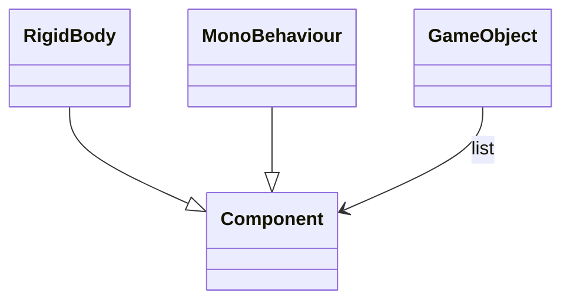

## 왜

게임 개발할때마다 개체간의 관계 정립 및 렌더 방식을 손 가는대로 했다.

마침 React-Three-Fiber [미니플젝](/demo/jukebox/) 하며 다른 사례들을 조사하다가 ECS라는 패턴을 발견했다. 직관적이고 실용적인 패턴이라고 생각돼서 기본적인 내용들을 정리해 본다. ECS의 자세한 내용 및 패턴 철학은 공부하며 참고한 링크들을 아래에 걸어둘테니 꼭! 읽어보시길

## 그동안 내가 했던 방법들

### C++ / DirectX

3D / 2D 게임의 클라이언트 및 서버를 개발했던 시기였다. 엔진 이라고 부를만한 프레임워크가 없이 렌더 부분만 래핑해놓은 유틸성 라이브러리만 가지고 개발을 했다.

상속을 기반으로 개체 내에서 Update, Render 모두 진행하는 구조로 개발했으며 대략 아래와 같다.

### Unity

Unity는 기본적으로 GameObject를 생성을 하고 기대하는 동작들을 스크립트로 만들어 오브젝트에 할당하는 컴포넌트 방식을 따른다. 입출력, 움직임, 렌더등을 컴포넌트화 시킨다. 하나의 거대한 클래스가 존재하는게 아닌, 분리된 역할을 가진 컴포넌트들의 조합으로 복잡한행동(behaviour)을 하는 개체를 만드는것. 이 구조 내에서 개발자의 역량과 취향에 따라 다양한 패턴을 적용하게 되는것이다.



각 컴포넌트에서 각자 하고싶은 목적을 이루면된다. 행동 및 렌더도 컴포넌트로 구현되며 이 과정중 다른 컴포넌트 혹은 GameObject를 참조할 수 있다.

```c#

using UnityEngine;
using System.Collections;

public class ExampleClass : MonoBehaviour {
    public float thrust;
    public Rigidbody rb;
    void Start() {
        rb = GetComponent<Rigidbody>();
    }
    void FixedUpdate() {
        rb.AddForce(transform.forward * thrust);
    }
}
```

### R3F(React Three Fiber)

React는 선언형 프로그래밍 라이브러리, Three는 그래픽 라이브러리이다. 두가지를 가지고 게임을 만들때 어떤식으로 사용하게 될까.

```jsx
<Canvas>
  <Scene>
    <Camera />
    <GameObjects>
      <Player name={"james"} weapons={weapons} />
      {otherPlayers}
      {enemies}
      <Fairy target={"james"} />
      <SomeEffect target={"james"} />
    </GameObjects>
  </Scene>
</Canvas>
```

Unity 처럼 캔바스에다가 오브젝트들을 나열해 놓게된다. 컴포넌트들은 상호 참조할 수 있고 부모 자식으로 놓일 수 있다. Fairy는 캐릭터를 따라다니는 요정이므로 아래 방법들처럼 구현할 수 있다고 본다. SomeEffect 도 비슷하다.

```jsx
const Fairy = ({ target }) => {
  const { findObjectByName } = useObjects();
  const ref = useRef()

  useFrame(() => {
    const targetObject = findObjectByName(target);
    ref.current.position = targetObject.position

    // do some actions
  })

  return <mesh ref={ref}>...</mesh>;
};

const Fairy = ({ paths }) => {
  ...
    useEffect(() => {
    const followPath = () => {
      if (path.length > 0) {
        const [newX, newY] = path[path.length - 1];
        setFairyX(newX);
        setFairyY(newY);
      }
    }});
  ...

  return <mesh ref>
};

```

### 개발을 하다보면

위의 방식 모두 각 객체마다 표현하고자 하는 데이터(상태, 목적), 그리고 행동을 직접 수행한다. 전통적 OOP의 개념 아래에 구현된 방식이다. 컴포넌트의 행위가 복잡해질 수록 코드 덩어리는 비대해지고 각 개체간의 커플링은 심화된다. 중복을 제거하기 위해 상속 등을 사용하게 되지만, 결국 요구사항의 변경이나 기능의 추가에 변경되는 코드의 양은 기하급수적으로 늘어난다.

## ECS(Entity Component System)

### ECS 소개

ECS는 컴포지션을 적극 활용하는 패러다임이다.

- Entity: 주체
- Component: 상태
- System: 행위

<mark>주체에 상태를 부여하면, 시스템(대자연)이 행위를 진행한다.</mark>

<figure>
  
  <figcaption>ECS pattern(출처: 유니티 매뉴얼)</figcaption>
</figure>

### Unity's GameObject 와의 차이

game object 는 Component Pattern 의 구현(http://gameprogrammingpatterns.com/component.html)

### 상속 과의 비교

### 나의 질문

- 어떤 함수는 데이터가 될 수 있을까?

### ECS + R3F 를 활용한 게임 구조

### ECS for Web

## 참고링크

[https://www.youtube.com/watch?v=\_U9wRgQyy6s](https://www.youtube.com/watch?v=_U9wRgQyy6s)

[https://www.sebaslab.com/the-quest-for-maintainable-code-and-the-path-to-ecs/](https://www.sebaslab.com/the-quest-for-maintainable-code-and-the-path-to-ecs/)

[https://www.sebaslab.com/code-design-articles/](https://www.sebaslab.com/code-design-articles/)
