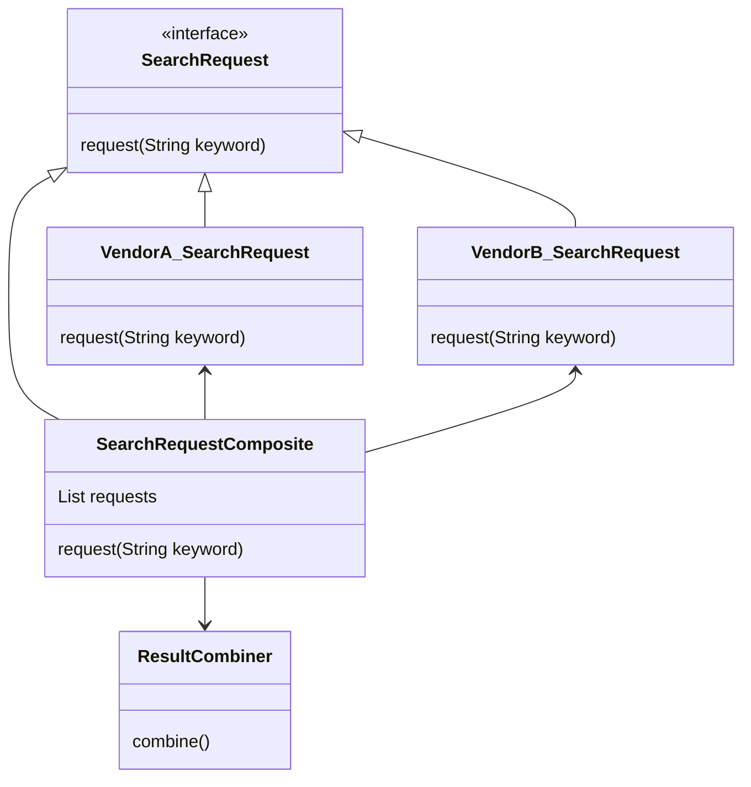

## 🦥 Composition pattern for invocation APIs in JAVA

I recently requested the design of a system that can invoke search APIs from multiple vendors and combine their results, with the ability to easily add APIs from additional vendors.


It's a very simple design, but at the same time, quite practical, I suppose.


My goal is 
  * 1. All I need to do when adding a new vendor API is to add the API logic and register the class.
  * 2. Api or composition of Apis should be invoked in the same way

My design here (with omitted detailed logics and slight class name changes)..."




My code here, let's assume that a 'request' represents a domain entity

1. interface

```java
package com.onejae.domain.port;
import com.onejae.domain.entity.VendorSearchResult;

public abstract class SearchRequest {
    public abstract VendorSearchResult request(String keyword);
    protected abstract String buildRequestUri(String keyword);
}

```

2. implementation of vendor api
```java
package com.onejae.adapter.apiprovider;

@Component
@Slf4j
@ConfigurationProperties(prefix = "api.vendor_name")
public class VendorA_SearchRequest extends SearchRequest {
    @Setter
    private String vendorName;

    @Setter
    private String priority;

    @Override
    public VendorSearchResult request(String keyword) {
        VendorSearchResult r = new VendorSearchResult(this.vendorName, this.priority);

        String requestUrl = this.buildRequestUri(keyword);

        // actual request
    }
}

```

3. SearchRequestComposite

```java
@Component
public class SearchRequestComposite extends SearchRequest {

  // use autowired here for convienient
  @Autowired
  private SearchRequest[] apiVendors;

  @Autowired
  private ResultCombiner resultCombiner;

  @Override
  public VendorSearchResult request(String keyword) {
    List<VendorSearchResult> vendorSearchResultList =
          Arrays.stream(apiVendors)
                // delegation can be used
                // .map(vendor -> SearchAction.createFromKeyword(keyword).goSearchWithApi(vendor))
                .map(vendor -> vendor.request(keyword))
                .toList();
  }
}


```

Lastly, add a bean provider to automatically create the 'requests' bean in the SearchRequestComposite.

```java

@Configuration
public class ApiVendorProvider implements ApplicationContextAware {

    private ApplicationContext applicationContext;

    private final static Class[] apiVendors = {
            VendorA_SearchRequest.class,
            VendorB_SearchRequest.class
    };

    // generates beans by class name
    @Bean
    public SearchRequest[] generateApiVendors() {
        return Arrays.stream(ApiVendorProvider.apiVendors)
                .map(v -> applicationContext.getBean(v))
                .toArray(SearchRequest[]::new);
    }

    @Override
    public void setApplicationContext(ApplicationContext applicationContext) throws BeansException {
        this.applicationContext = applicationContext;
    }
}

```


